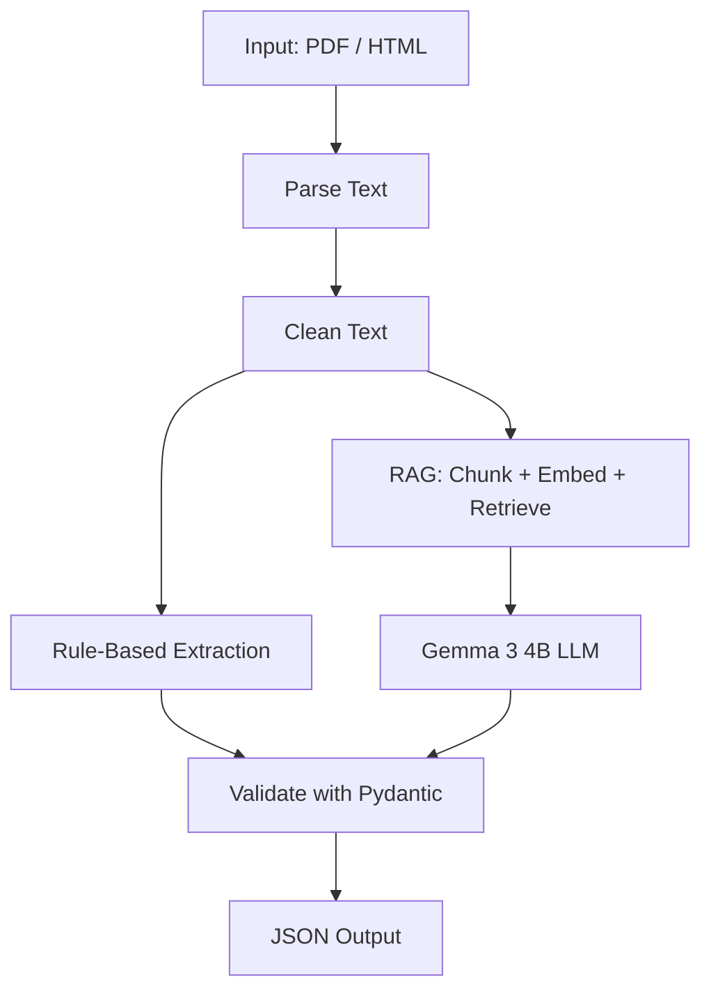

#  Intelligence File Extractor

A Python pipeline that extracts structured information from RFP (Request for Proposal) documents (PDF/HTML) and outputs clean JSON.

It uses a hybrid approach:
- **Rule-based extraction** (regex) for predictable fields like emails, phone numbers, dates, and RFP numbers.
- **RAG + a local LLM (Gemma 3 4B via Ollama)** for fields that need context understanding, like payment terms, bid summary, and product specifications.

---

## How It Works



**Steps:**
1. Scan `data/input/` for PDF/HTML documents
2. Parse and clean the text
3. Extract simple fields (emails, dates, RFP numbers) using regex
4. Chunk the document, embed the chunks, and store them in FAISS
5. Retrieve the most relevant chunks for each remaining field
6. Send that context to Gemma 3 4B to extract the field value
7. Validate everything against a Pydantic schema
8. Save the result as JSON in `data/output/`

---

## Extracted Fields

`bid_number`, `title`, `due_date`, `bid_submission_type`, `term_of_bid`, `pre_bid_meeting`, `installation`, `bid_bond_requirement`, `delivery_date`, `payment_terms`, `additional_documentation_required`, `mfg_for_registration`, `contract_or_cooperative`, `model_no`, `part_no`, `product`, `contact_info`, `company_name`, `bid_summary`, `product_specification`

Fields not found in a document are returned as `null`.

---

## Project Structure

```text
rfp-intelligence-extractor/
├── app/
│   ├── ingestion/        # Find and detect input files
│   ├── parsers/          # PDF & HTML text extraction
│   ├── processing/       # Text cleaning
│   ├── extraction/       # Rule-based + LLM extraction, schema
│   ├── rag/              # Chunking, embeddings, FAISS retrieval
│   ├── output/           # JSON writer
│   └── batch/            # Runs the full pipeline
├── data/
│   ├── input/             # Put your RFP documents here
│   ├── cache/              # Cached embeddings/FAISS index
│   └── output/             # ⭐ Extracted JSON files
├── requirements.txt
└── README.md
```

---

## Setup

### 1. Install Python 3.14+

Check your version:
```bash
python --version
```

### 2. Create and activate a virtual environment

```bash
python -m venv .venv
```

macOS/Linux:
```bash
source .venv/bin/activate
```

Windows:
```bash
.venv\Scripts\activate
```

### 3. Install Python dependencies

```bash
pip install -r requirements.txt
```

### 4. Install Ollama

Ollama runs the LLM locally — no API key needed.

- **Download:** go to [https://ollama.com/download](https://ollama.com/download) and install it for your OS (Windows / macOS / Linux).
- Or on macOS/Linux, install via terminal:
  ```bash
  curl -fsSL https://ollama.com/install.sh | sh
  ```

Verify it installed correctly:
```bash
ollama --version
```

### 5. Download the Gemma model

```bash
ollama pull gemma3:4b
```

Confirm it's available:
```bash
ollama list
```

You should see `gemma3:4b` in the list.

> Ollama runs as a background service after installation, so it will already be running when you start the pipeline. If it's not, start it manually with `ollama serve`.

---

## Usage

### 1. Add your documents

Place your RFP files (PDF/HTML/HTM) inside `data/input/`. Subfolders are fine:

```text
data/input/
└── rfp/
    ├── main.pdf
    └── addendum1.html
```

### 2. Run the pipeline

```bash
python -m app.batch.process_documents
```

### 3. Get your results

JSON output files will appear in `data/output/`, one per document:

```text
data/output/
└── main.json
```

Example output:
```json
{
    "bid_number": "JA-207652",
    "title": "Student and Staff Computing Devices",
    "due_date": "July 9, 2024 at 2:00 PM CST",
    "bid_submission_type": ["Electronic submission"],
    "payment_terms": "...",
    "contact_info": "...",
    "company_name": "...",
    "bid_summary": "..."
}
```

---
## 13. Output

The extracted JSON files are stored under:

```text
data/output/
## Troubleshooting

| Problem | Fix |
|---|---|
| `ollama: command not found` | Reinstall from [ollama.com/download](https://ollama.com/download) |
| Model not found | `ollama pull gemma3:4b` |
| No documents processed | Make sure files are in `data/input/` and are `.pdf`, `.html`, or `.htm` |
| Old/wrong results after editing a document | Delete its cache folder: `rm -rf data/cache/<document_id>` and rerun |
| Import errors | Make sure the virtual environment is active, then `pip install -r requirements.txt` |

---

## Tech Stack

| Technology | Purpose |
|---|---|
| **Python 3.14+** | Core language for the pipeline |
| **PyMuPDF** | Extracts text from PDF documents |
| **BeautifulSoup + lxml** | Parses and extracts text from HTML/HTM documents |
| **Sentence Transformers** (`all-MiniLM-L6-v2`) | Converts text chunks into embeddings for semantic search |
| **FAISS** | Vector similarity search — finds the most relevant chunks for each field |
| **Ollama** | Runs the LLM locally, no API key or internet required |
| **Gemma 3 4B** | The local LLM used to extract context-dependent fields |
| **Pydantic** | Validates and enforces the final JSON output schema |
| **NumPy** | Vector/array operations used during embedding and retrieval |
